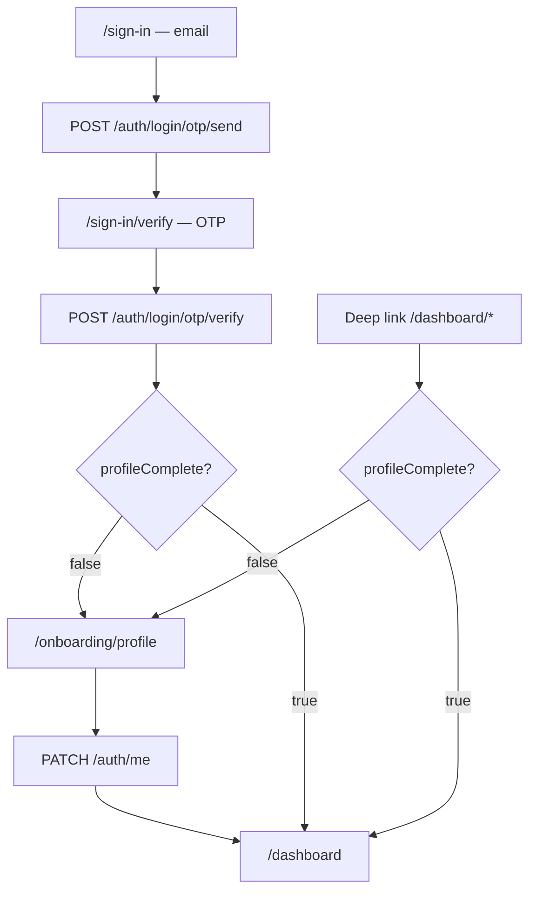

# Frontend implementation guide — passwordless auth + profile onboarding

> **Audience:** AI agents and engineers working in the **`asset-union`** repo (Next.js App Router + Tailwind).  
> **Backend repo:** `asset-union-backend` (this repo) — API contract below is authoritative as of 2026-05-23.  
> **Goal:** Match the investor sign-in/sign-up flow: email → OTP verify → onboarding profile → dashboard.

---

## 0) Mandatory preflight

Before changing UI or auth code in `asset-union`:

1. Read this document end-to-end.
2. Skim `docs/UI_TO_API_INVENTORY.md` (Auth domain) in **asset-union-backend** for screen mapping.
3. Inspect existing auth routes, middleware, and API client in `asset-union` — extend patterns; do not duplicate parallel auth systems.
4. Confirm `NEXT_PUBLIC_API_URL` points at the backend (e.g. `http://localhost:8000/v1`).

**Hard rules:**

- Sign-in and sign-up use the **same** OTP flow (no separate register form with password).
- The OTP verify screen collects **only** the 6-digit code — no `fullName`, `country`, or `phoneNumber`.
- Route users using **`profileComplete`** from the API — not `isNewUser` alone.
- Block dashboard until profile is submitted; backend also returns `403 PROFILE_INCOMPLETE` on product APIs.

---

## 1) User journey



| Step | UI                           | API                                   |
| ---- | ---------------------------- | ------------------------------------- |
| 1    | Enter email                  | `POST /v1/auth/login/otp/send`        |
| 2    | Enter 6-digit OTP            | `POST /v1/auth/login/otp/verify`      |
| 3    | Complete profile (if needed) | `PATCH /v1/auth/me`                   |
| 4    | Dashboard                    | Product APIs (KYC, wallet, orders, …) |

Returning users with an incomplete profile (edge case) follow step 3 after OTP verify.

---

## 2) API contract

Base URL: `{NEXT_PUBLIC_API_URL}` (must include `/v1` prefix).

### 2.1 Send OTP

```
POST /v1/auth/login/otp/send
Content-Type: application/json

{ "email": "user@example.com" }
```

**200:**

```json
{
  "otpSessionId": "uuid",
  "expiresAt": 1700000000,
  "maskedEmail": "u***@example.com",
  "isExistingUser": false
}
```

Store `otpSessionId` in React state or `sessionStorage` until verify succeeds.

**Errors:** `403 ACCOUNT_SUSPENDED`, `429 OTP_RATE_LIMITED`, `503 OTP_UNAVAILABLE`, `400 VALIDATION_ERROR`.

---

### 2.2 Verify OTP (auth only)

```
POST /v1/auth/login/otp/verify
Content-Type: application/json

{
  "otpSessionId": "<from send step>",
  "code": "123456"
}
```

**Do not send** `fullName`, `country`, or `phoneNumber` on this request.

**200:**

```json
{
  "accessToken": "...",
  "refreshToken": "...",
  "expiresAt": 1700000000,
  "isNewUser": true,
  "profileComplete": false,
  "user": {
    "id": "...",
    "email": "user@example.com",
    "fullName": null,
    "kycStatus": "not_submitted",
    "walletStatus": "not_registered",
    "profileComplete": false
  }
}
```

**After success:**

1. Persist tokens (prefer httpOnly cookies; if using memory/localStorage, document the choice).
2. Update auth context with `user` + top-level `profileComplete`.
3. Redirect:
   - `profileComplete === false` → `/onboarding/profile`
   - `profileComplete === true` → `/dashboard` or `callbackUrl`

**Errors:** `401 OTP_INVALID`, `410 OTP_SESSION_NOT_FOUND`, `429 OTP_MAX_ATTEMPTS`, `403 ACCOUNT_SUSPENDED`.

---

### 2.3 Complete profile (onboarding)

```
PATCH /v1/auth/me
Authorization: Bearer <accessToken>
Content-Type: application/json

{
  "fullName": "Jane Doe",
  "country": "US",
  "phoneNumber": "+14155552671"
}
```

**Validation (backend enforces):**

| Field         | Rule                                                       |
| ------------- | ---------------------------------------------------------- |
| `fullName`    | Non-empty string                                           |
| `country`     | Non-empty string (use ISO 3166-1 alpha-2, e.g. `US`, `CA`) |
| `phoneNumber` | E.164: `^\+[1-9]\d{7,14}$` (e.g. `+14155552671`)           |

**200:** Same shape as `GET /auth/me` with `profileComplete: true` and populated fields.

**Errors:** `400 VALIDATION_ERROR` (with `details`), `401 UNAUTHORIZED`, `404 USER_NOT_FOUND`.

---

### 2.4 Get current user (session bootstrap)

```
GET /v1/auth/me
Authorization: Bearer <accessToken>
```

**200:**

```json
{
  "id": "...",
  "email": "user@example.com",
  "fullName": null,
  "country": "US",
  "phoneNumber": "+14155552671",
  "profileComplete": false,
  "profileCompletedAt": null,
  "status": "active",
  "kycStatus": "not_submitted",
  "emailVerifiedAt": 1700000000,
  "createdAt": 1700000000
}
```

Call on app load, after token refresh, and after successful `PATCH /auth/me`.

---

### 2.5 Refresh & logout

```
POST /v1/auth/refresh
{ "refreshToken": "..." }

POST /v1/auth/logout
Authorization: Bearer <accessToken>
{ "refreshToken": "..." }  // optional
```

After refresh, re-fetch `GET /auth/me` and re-apply `profileComplete` routing.

---

### 2.6 Profile gate on product APIs

These routes require **`profileComplete === true`** on the server:

- `/v1/kyc/*` (user)
- `/v1/wallets/*`
- `/v1/orders/*`
- `/v1/payments/*`
- `/v1/portfolio/*`

**403 when profile incomplete:**

```json
{
  "error": {
    "code": "PROFILE_INCOMPLETE",
    "message": "Complete your profile (full name, country, phone number) before accessing this resource"
  }
}
```

**Allowed without complete profile:** `GET /auth/me`, `PATCH /auth/me`, `POST /auth/refresh`, `POST /auth/logout`.

---

## 3) TypeScript types (shared or in `lib/api/auth.ts`)

```typescript
export type AuthUser = {
  id: string;
  email: string;
  fullName: string | null;
  country?: string;
  phoneNumber?: string;
  profileComplete: boolean;
  profileCompletedAt?: number;
  status: string;
  kycStatus: string;
  walletStatus?: string;
  emailVerifiedAt?: number;
  createdAt?: number;
};

export type OtpSendResponse = {
  otpSessionId: string;
  expiresAt: number;
  maskedEmail: string;
  isExistingUser: boolean;
};

export type OtpVerifyResponse = {
  accessToken: string;
  refreshToken: string;
  expiresAt: number;
  isNewUser: boolean;
  profileComplete: boolean;
  user: Pick<
    AuthUser,
    | "id"
    | "email"
    | "fullName"
    | "kycStatus"
    | "walletStatus"
    | "profileComplete"
  >;
};

export type UpdateProfileRequest = {
  fullName: string;
  country: string;
  phoneNumber: string;
};

export type ApiError = {
  error: {
    code: string;
    message: string;
    details?: unknown;
  };
};
```

---

## 4) Route structure (Next.js App Router)

Suggested layout under `app/`:

```
app/
  (auth)/
    sign-in/page.tsx           # email → send OTP
    sign-in/verify/page.tsx    # OTP only → verify
  (onboarding)/
    onboarding/profile/page.tsx  # fullName, country, phone → PATCH /me
  (app)/
    dashboard/...              # protected app shell
  middleware.ts
```

| Route | Auth | profileComplete | Action |
| --- | --- | --- | --- |
| `/sign-in`, `/sign-in/verify` | Public | — | Allow; redirect to dashboard if already complete |
| `/onboarding/profile` | Required | false | Show form |
| `/dashboard/**` | Required | true | Main app |

Use a `callbackUrl` search param through sign-in → verify → onboarding → dashboard.

---

## 5) Middleware (`middleware.ts`)

Implement server-side guards (do not rely on client state alone):

1. **No token** + protected route (`/dashboard`, `/onboarding`) → redirect `/sign-in?callbackUrl=...`
2. **Has token** + `profileComplete === false` + path starts with `/dashboard` → redirect `/onboarding/profile`
3. **Has token** + `profileComplete === true` + path is `/onboarding/profile` → redirect `/dashboard`
4. **Has token** + `/sign-in` → redirect to dashboard or onboarding based on `profileComplete`

**Resolving `profileComplete` in middleware:**

- Option A: Call `GET /v1/auth/me` with access token from cookie (add short timeout/cache).
- Option B: Set a `profileComplete` flag on a session cookie when verify/PATCH succeeds; refresh on `/me`.

Prefer Option A as source of truth; Option B only as a performance cache with invalidation after PATCH.

---

## 6) Auth context / API client

Provide (or extend) an `AuthProvider`:

- `user: AuthUser | null`
- `profileComplete: boolean` (derived from `user.profileComplete`)
- `sendOtp(email)`, `verifyOtp(sessionId, code)`, `updateProfile(data)`, `refreshSession()`, `logout()`
- Central `apiFetch()` that attaches `Authorization: Bearer ...`
- On `403` + `error.code === "PROFILE_INCOMPLETE"` → `router.replace("/onboarding/profile")`

**Display name before onboarding:** When `fullName` is `null`, show **email** in nav/avatar — do not derive a fake name from the email local part.

---

## 7) Page specs

### 7.1 `/sign-in`

- Single email field + submit.
- Call send OTP → navigate to `/sign-in/verify` with `otpSessionId` (state or sessionStorage).
- Show `maskedEmail` from response when available.

### 7.2 `/sign-in/verify`

- 6-digit OTP input only.
- Submit → verify → store tokens → redirect per §2.2.
- Link to resend OTP (call send again with same email).

### 7.3 `/onboarding/profile`

- Read-only email (from auth context).
- Fields: **Full name**, **Country** (select/combobox, ISO code), **Phone** (normalize to E.164 before submit).
- Client validation mirrors backend rules.
- Submit → `PATCH /auth/me` → refresh user → `router.replace(callbackUrl ?? "/dashboard")`.
- No skip / “later” link — backend blocks product APIs regardless.

**Phone UX tip:** Accept national format in the input; convert to E.164 on submit (e.g. libphonenumber-js or country-aware prefix).

---

## 8) Remove / update legacy UI

If the frontend still has:

- Password fields on sign-in/sign-up → remove for investor auth.
- `fullName` / `country` on OTP verify → remove.
- Separate `/register` route → merge into `/sign-in` or redirect to it.
- Calls to `/v1/auth/register`, `/v1/auth/login` (password) → replace with OTP endpoints above.

---

## 9) Testing checklist

Manual or E2E (Playwright):

- [ ] New user: email → OTP → `/onboarding/profile` with `fullName: null`, `profileComplete: false`
- [ ] Submit valid profile → `/dashboard`, `GET /me` shows `profileComplete: true`
- [ ] Direct `/dashboard` visit before profile → redirected to onboarding
- [ ] Completed user: OTP → `/dashboard` (skip onboarding)
- [ ] `/onboarding/profile` when already complete → redirect dashboard
- [ ] Invalid phone (missing `+`, wrong length) → validation error
- [ ] Wallet/KYC fetch before profile → `403 PROFILE_INCOMPLETE` + redirect
- [ ] Token refresh preserves correct routing based on `profileComplete`

---

## 10) Environment & CORS

```env
# asset-union .env.local
NEXT_PUBLIC_API_URL=http://localhost:8000/v1
```

Backend must allow the frontend origin in CORS (see `apps/server` config). Redis + email must be running for OTP in local dev.

---

## 11) Backend reference files

When in doubt, read implementation in **asset-union-backend**:

| Topic | Path |
| --- | --- |
| Routes | `packages/api/src/http/v1/auth/auth.routes.ts` |
| DTOs | `packages/api/src/http/v1/auth/auth.dto.ts` |
| Auth service | `packages/api/src/services/auth/auth.service.ts` |
| Profile gate middleware | `packages/api/src/shared/middleware/auth.ts` (`requireCompleteUserProfile`) |
| Postman examples | `postman/Asset_Union_API_Collection.json` (Send OTP, Verify OTP, Complete Profile) |

---

## 12) Agent execution summary

1. Map existing `asset-union` auth pages to §4 route structure.
2. Wire API client to §2 endpoints; add types from §3.
3. Implement §5 middleware + §6 auth context.
4. Build §7 onboarding page; strip profile fields from OTP verify.
5. Add global `PROFILE_INCOMPLETE` handler on API client.
6. Run §9 checklist; update any E2E auth specs.

**Done when:** New users complete OTP → onboarding → dashboard; incomplete profiles cannot reach dashboard or load product data; returning complete users go straight to dashboard after OTP.
